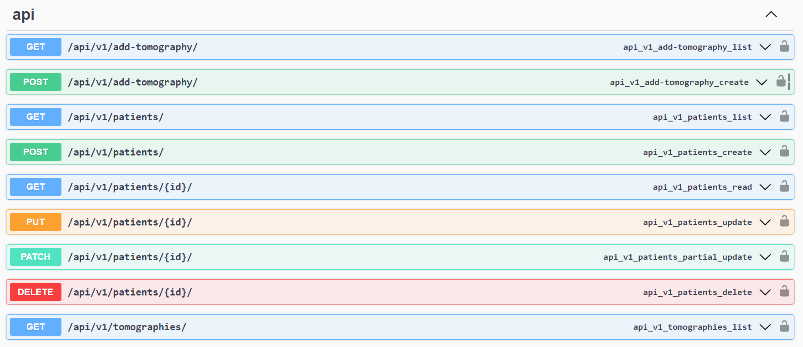
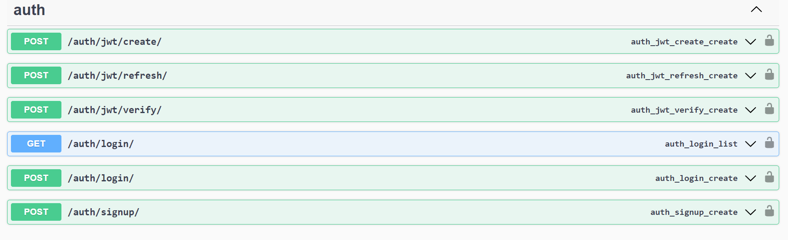

## MediScanAI | Brain Tumor Classifier API

MediScanAI is a computer vision healthcare project applying AI for medical insights. It classifies brain tumor types based on tomography images.

### Request preview

### Docs

<<<<<<< HEAD

=======

>>>>>>> 2bc1a28 (docker compose updated)

