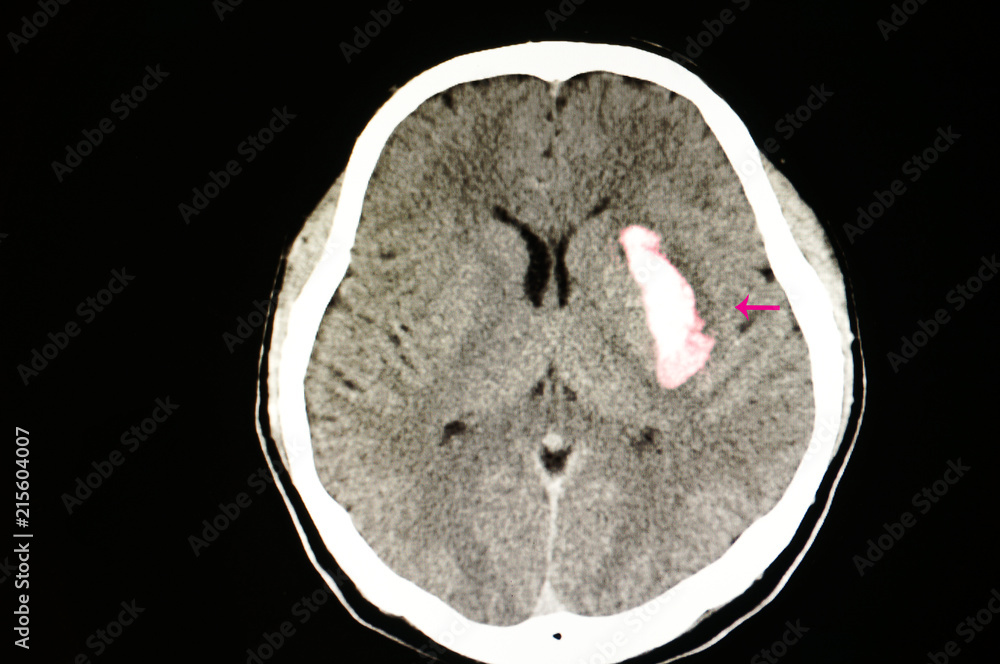
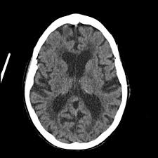
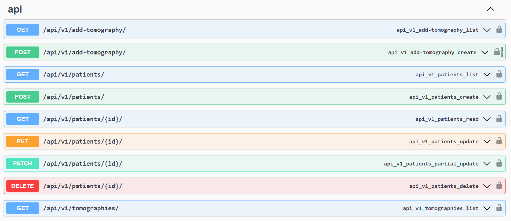
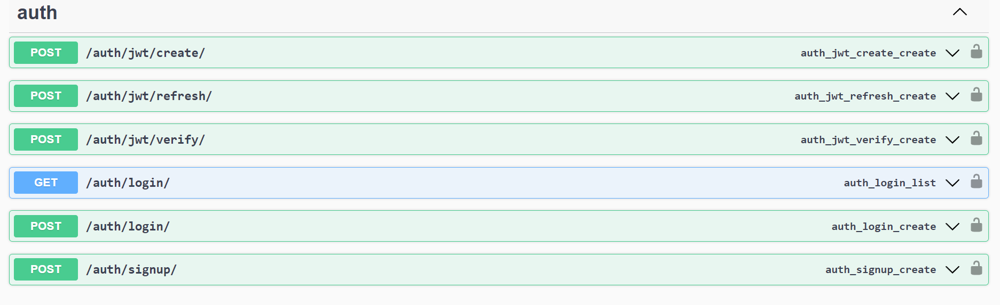

## MediScanAI | Brain Tumor Classifier

MediScanAI is a computer vision healthcare web app applying AI for medical insights. It classifies brain tumor types based on tomography images.

https://github.com/user-attachments/assets/126f216a-39a2-42b9-afed-c11e98f40679

### Key Features

- **Patient Registration**

- - Doctors and radiologists can easily register new patients, enabling comprehensive medical records management.

- **Signin and Signup for Medical Professionals**

- - Seamless login and signup processes designed specifically for doctors and radiologists.

- **Medical Image Management**

- - Medical professionals can upload and associate tomography images with patient records for detailed analysis.

#

### **Tumor Type Classification**

    
    
    

The platform provides probabilities for different types of brain tumors, including:

**Meningioma**: A meningioma is a type of tumor that arises from the meninges, the membranes that surround your brain and spinal cord. These tumors are often benign and grow slowly.

**Pituitary Tumor (Pituitary Adenoma)**: This type of tumor develops in the pituitary gland, a small gland at the base of the brain that produces many hormones.

**Glioma**: Gliomas are tumors that arise from glial cells, which support the function of the brain's nerve cells. They can vary in severity from low-grade to highly aggressive forms.

**No Tumor Detected**: Provides reassurance when no tumor is identified.

### Docs

### References:

https://www.kaggle.com/code/fahadmehfoooz/brain-tumor-detection-keras-pytorch
https://www.kaggle.com/datasets/navoneel/brain-mri-images-for-brain-tumor-detection/code

## Disclaimer

MediScanAI is developed with educational purposes in mind. It serves as a tool to demonstrate the application of AI in medical imaging and tumor classification. By providing accurate insights and probabilities, the platform aids medical professionals in making informed decisions and improving patient care.
